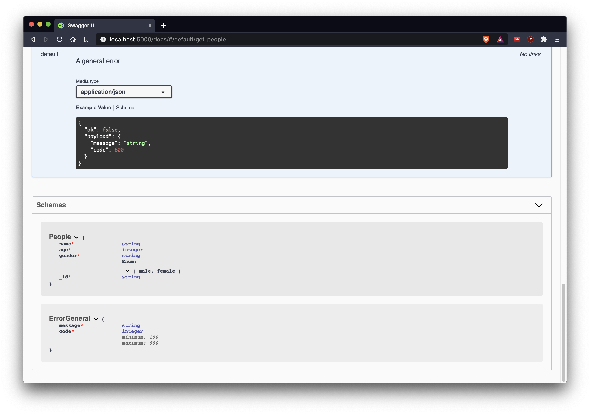

## monorepo example with backend and frontend using npm 7.x

**frontend** overview:

- using [create-react-app](https://create-react-app.dev/) for a quick react application setup with [tailwindcss](https://tailwindcss.com/docs/guides/create-react-app) for application styling
- filter source of true is the url and they are synced with application state
- using [react suspense](https://reactjs.org/docs/concurrent-mode-suspense.html) and [react query](https://react-query.tanstack.com) for remote state/cache management
- full-rendering tests with [react testing library](https://testing-library.com/docs/react-testing-library/intro/), included react suspense and react query

**backend** overview:

- traditional [express](https://www.npmjs.com/package/express) application
- using [nedb](https://github.com/louischatriot/nedb) for an in memory database
- api documented swagger with [swagger-ui-express](https://www.npmjs.com/package/swagger-ui-express)
- integratio tests with [supertest](https://www.npmjs.com/package/supertest)

## how to run it?

the requirements are:

- node >= 12.x
- npm 7.x

install the dependencies from the root folder:

```
$ npm install
```

from here you will need two tabs open in your terminal,

go to `projects/backend` and:

```
$ cd projects/backend
$ npm start
```

go to `projects/frontend` and:

```
$ cd projects/frontend
$ npm start
```

## runnings tests

in each project folder, to run all tests a single time, you can use:

```
$ npm test
```

for watch mode use:

```
$ npm run test:watch
```

## screenshots

**frontend** screenshots:


**backend** screenshots:



